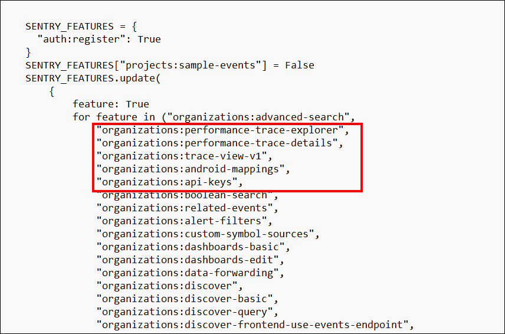

## Sentry Web Pod Issue: **no app loaded. GAME OVER**

### **Issue**

The container logs showed the following error:

```
unable to load app 0 (mountpoint='') (callable not found or import error)
*** no app loaded. GAME OVER ***
```

The pod remained in `Running` state but failed to properly serve the application.

---

### **Cause**

This issue occurs because the **Sentry database migrations were not applied** after the deployment. Without these migrations:

* Required database tables and configurations are missing.
* The application cannot fully initialize.
* uWSGI is unable to load the Django app, resulting in the "no app loaded" error.

---

### ✅ **Resolution**

Running the following command inside the pod resolves the issue:

```bash
kubectl exec -it sentry-web-7d5657dd6f-w844h -n dev-sentry -- sentry upgrade
```

This command:

* Applies pending database migrations.
* Sets up required internal Sentry data.
* Allows the web pod to fully initialize and start serving requests.

Here's a clean and professional Markdown (`.md`) version of the documentation you can copy and paste:

---

## 1. Enabling Trace View in Self-Hosted Sentry

To enable distributed tracing and **Trace View** in your self-hosted Sentry deployment (e.g., version `25.5.1+`), you need to configure `sentry.conf.py` properly with specific feature flags.

### Step 1: Edit the `sentry.conf.py`

Run the following command to edit the config map in your Kubernetes cluster:

```bash
kubectl edit configmap sentry-sentry -n dev-sentry
```

In the file, update the `SENTRY_FEATURES` section like this:

#### Basic Trace View Support

```python
SENTRY_FEATURES.update({
    "organizations:trace-view-v1": True,
    "organizations:performance-trace-explorer": True,
    "organizations:performance-trace-details": True,
})
```


These three flags are **sufficient** to enable basic trace viewing and interaction in the Sentry UI.

### Advanced Trace Features (Optional)

If you want to enable **Trace Explorer**, **span-based metrics**, and **advanced analytics**, you can extend the feature flags like this:

```python
SENTRY_FEATURES.update({
    "organizations:trace-view-v1": True,
    "organizations:performance-trace-explorer": True,
    "organizations:performance-trace-details": True,
    "organizations:transaction-metrics-extraction": True,
    "organizations:anomaly-detection-eap": True,
    "organizations:dashboards-eap": True,
    "organizations:ingest-spans-in-eap": True,
    "organizations:indexed-spans-extraction": True,
    "organizations:visibility-explore-view": True,
    "organizations:visibility-explore-admin": True,
    "organizations:visibility-explore-equations": True,
    "organizations:visibility-explore-rpc": True,
    "organizations:visibility-explore-range-high": True,
    "organizations:explore-multi-query": True,
})
```

> Only enable these if you're aiming to use **advanced analytics**, **EAP spans**, or **custom trace explorers**

### Step 2: Restart Sentry Pods

After editing the config, restart your Sentry services:

```bash
kubectl rollout restart deployment sentry-web -n dev-sentry
```

### Step 3: Verify in the UI

After the restart:

* Log in to the Sentry web interface.
* Navigate to **Performance > Traces**.
* If successful, you should **see traces and spans** listed.


If you see a message like:

> *“You do not have access to this feature”*

Ensure:

* The correct flags are enabled.
* The pods were fully restarted.
* You're using the correct `sentry.conf.py` (and it's correctly mounted or injected into the pod).
  
## Summary

| Feature Set              | Required Flags                                                                        |
| ------------------------ | ------------------------------------------------------------------------------------- |
| Basic Trace View         | `trace-view-v1`, `performance-trace-explorer`, `performance-trace-details`            |
| Advanced Span & Explorer | Add additional flags like `visibility-explore-view`, `indexed-spans-extraction`, etc. |


## References

* [GitHub Issue #3592](https://github.com/getsentry/self-hosted/issues/3592)
* [GitHub Issue #3272](https://github.com/getsentry/self-hosted/issues/3272)
* [Official Self-hosted Repo](https://github.com/getsentry/self-hosted)
* [GitHub Issue #3272 - issuecomment-2949112982](https://github.com/getsentry/self-hosted/issues/3592#issuecomment-2949112982)
